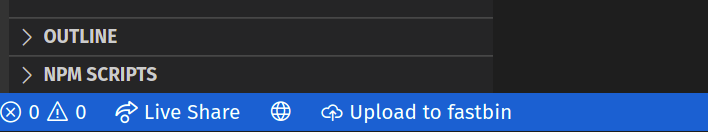
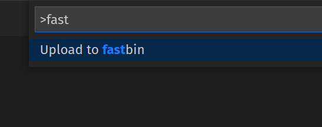

# fastbin for Visual Studio Code

Upload your code to [fastbin](https://fastbin.xyz) directly from Visual Studio
Code!

## Usage

Just open a document in your editor and use the button in the status bar:



... or use the command pallette:



You can also configure a keyboard shortcut for the `vsc-fastbin.upload`
command.

The extension will try to generate the extension of the uploaded snippet based
on the language of the document. By default, it will copy the URL of the snippet
page to your clipboard, but a toast in the notification zone of the editor will
allow you to copy the raw URL instead.

## Configuration

Do you have a custom fastbin instane that you want to use instead? You can
specify the URL to that instance using the `vsc-fastbin.apiUrl` configuration
option:

```json
{
  "vsc-fastbin.apiUrl": "https://my-fastbin.xyz"
}
```

*Note: You should not put a trailing slash at the end of the URL.*

## Contribution

**1. Clone the repo:**

```sh
git clone git@github.com:jozsefsallai/vsc-fastbin.git
```

**2. Install the dependencies:**

```sh
npm i
```

**3. Watch or compile:**

```sh
npm run watch
npm run compile
```

Don't forget to make sure that your changes pass the linter:

```sh
npm run lint
```

## License

MIT.
